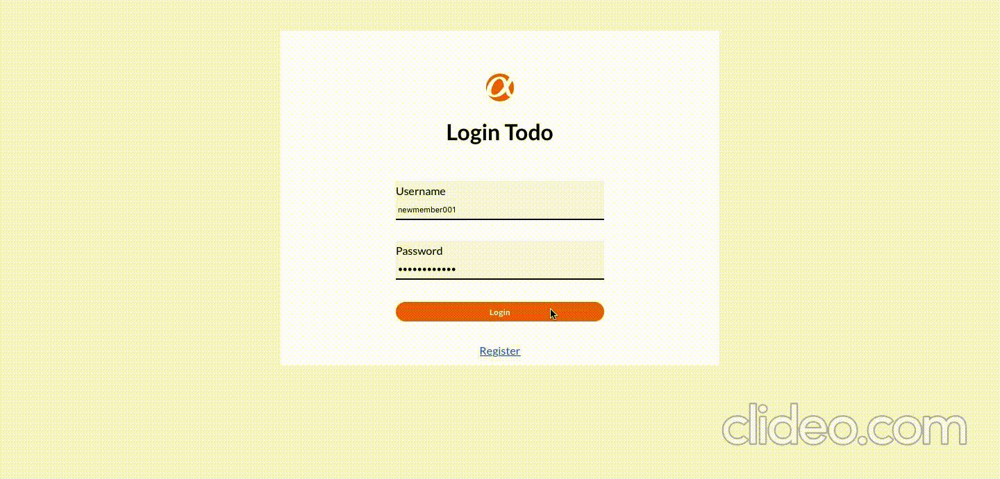

# Todo List X MVC with React



## Features

- View, add new and delete todos
- Mark the todos as complete/incomplete
- Double click to edit a todo, press Enter to save changes, press Esc to cancel
- CRUD functions are connected to an API on a server
- Authentication required for access

## Deployment

Clone the project:

```bash
  git clone https://github.com/AnnnieWann/todolist-react.git
```

Install the necessary dependencies:

```bash
  npm install
```

To run the project:

```bash
  npm start
```

You can browse the project by opening your browser and navigating to "http://localhost:3000".

To stop using the project, use the following command in the terminal:

```bash
  ctrl + c
```
